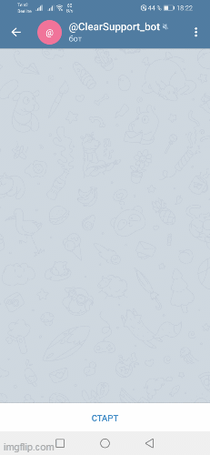

# Боты для Telegram и VK, обученные нейросетью

Проект представляет [Telegram-бота](t.me/ClearSupport_bot) и [VK-бота](https://vk.com/club216709478), поддерживающих клиентов вымышленного издательства "Игра глаголов".



## Описание

Представленные боты - это пример разработки ботов, разгружающих службу технической поддержки организации. Особенностью ботов является то, что для их обучения тому, как распознавать вопросы и как отвечать на них, используется нейросеть [Google DialogFlow](https://cloud.google.com/dialogflow/docs/).

Боты способны дообучаться с помощью специальной предоставленной в комплекте утилиты. Для этого нужно только подготовить файл в формате json c возможными вопросами пользователей и ответами на них.

На данный момент боты способны отвечать на вопросы из следующих категорий:

1. Восстановление пароля.
2. Причины бана.
3. Удаление аккаунта.
4. Устройство на работу.
5. Вопросы от партнёров.

В случае, если бот не знает ответа на вопрос, он отправляет в Telegram сообщение модератору о необходимости вмешательства.

По ссылкам вы можете протестировать работу [Telegram-бота](t.me/ClearSupport_bot) или [VK-бота](https://vk.com/club216709478).

## Самостоятельное использование ботов

### Как установить

Для запуска ботов вам понадобится Python версии 3.8.

Скачайте код с GitHub.

Создайте виртуальное окружение и активируйте его:
```
python -m venv venv
cd venv/Scripts
activate
cd ../..
```

Установите зависимости с помощью `pip` (или `pip3`, есть конфликт с Python2):
```
pip install -r requirements.txt
```

### Переменные окружения

Часть настроек утилит берётся из переменных окружения. Чтобы их определить, создайте файл `.env` в той же папке, где и скрипты, и запишите туда данные в таком формате: `ПЕРЕМЕННАЯ=значение`.

Доступно 5 обязательных переменных:

- `TELEGRAM_BOT_TOKEN` - API-токен Telegram-бота, с помощью которого будет осуществляться отправка уведомлений. Если такого telegram-бота пока нет, [создайте его](https://way23.ru/регистрация-бота-в-telegram.html).
- `TELEGRAM_MODERATOR_CHAT_ID` - ID чата модератора ботов, в который боты присылают сообщения об ошибках.
- `VK_GROUP_TOKEN` - API-токен группы ВКонтакте. Чтобы получить этот токен, нужно [Создать группу ВКонтакте](https://vk.com/groups?tab=admin), разрешить боту отправлять сообщения от имени группы и получить токен в меню "Работа с API" ВКонтакте.
- `GOOGLE_CLOUD_PROJECT` - идентификатор проекта DialogFlow ([Инструкция по созданию](https://cloud.google.com/dialogflow/es/docs/quick/setup)).
- `GOOGLE_APPLICATION_CREDENTIALS` - путь к json-файлу с Application Default Credentials ([см. инструкцию по созданию](https://cloud.google.com/docs/authentication/client-libraries)).

Пример содержимого файла .env:
```
#
TELEGRAM_BOT_TOKEN=958423683:AAEAtJ5Lde5YYfkjergber
TELEGRAM_MODERATOR_CHAT_ID=12345
VK_GROUP_TOKEN=vk1.HJKJJK89479shghadosAHKLkhdkhuch654758GHKFHHKgk848
GOOGLE_CLOUD_PROJECT=moulin-start-55
GOOGLE_APPLICATION_CREDENTIALS=google-credentials.json
```

### Как запустить

Предварительно нужно обучить ботов. Для этого подготовьте json-файл c вопросами и ответами. Пример json-файла нужной структуры - `questions.json`.
Для обучения ботов измените вопросы и ответы в этом файле, как вам необходимо, и запустите в командной строке консоли команду:
```
python dialogflow_create_intents.py
```
Для запуска каждого из ботов откройте консоль `cmd` наберите в командной строке соответствующую боту команду:
```
python telegram_bot.py
python vk_bot.py
```

### Цель проекта

Код написан в образовательных целях на онлайн-курсе для веб-разработчиков [dvmn.org](https://dvmn.org/).
